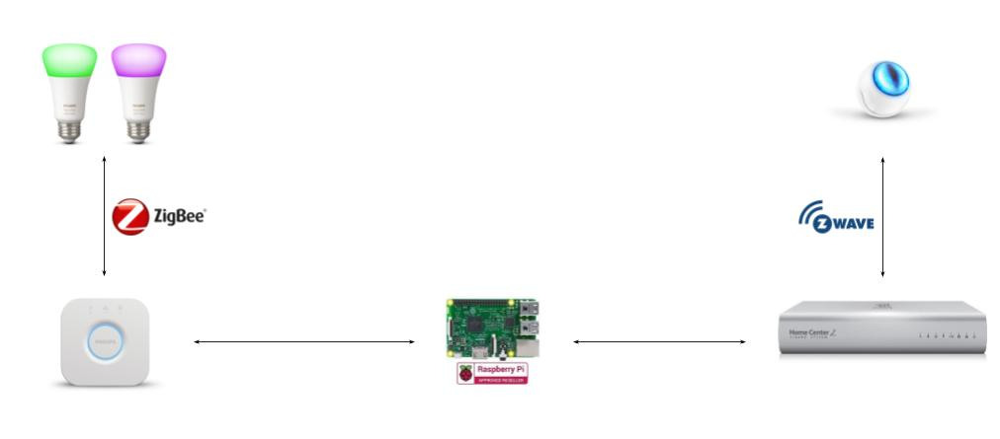

# fibaro-motion-sensor-philips-hue-interaction

This repository includes code for an intelligent lighting control system using Internet of Things, more specifically Fibaro Motion Sensors and Philips Hue lights. The system automatically turns on the lights when a motion is detected and turns the lights off after a certain time.

### Requirements

The system requires the 3 following parts:
- Fibaro Home Center 2 and Fibaro Motion Sensors for the motion detection
- Philips Hue bridge and lights
- A server with Python(flask) installed, it can be a Raspberry Pi, a laptop or an instance on the cloud

### Getting started

1. Configure Philips Hue
    - Install the Philips Hue bridge and lights.
    - Reserve a static IP address for the bridge from either Hue mobile app or your DHCP server.

2. Configure the server
    - Reserve a static IP address for the server.
    - Install required Python libraries.
    - Rename or copy `server/config.yml.dist` to `server/config.yml` and add your Philips Hue bridge API key and IP address into `server/config.yml`.
    - Launch the flask server by running `flask run` and add it as a system service later.

3. Configure Fibaro sensors and scenes
    - Install Fibaro Home Center 2 and connect it with Fibaro Motion Sensors.
    - Create your rooms on Fibaro GUI.
    - For each room, create a tripped scene and an untripped scene by pasting the corresponding lua code and change the server IP address to your actual server address.
    - (Optional) Install Philips Hue plugin on Fibaro GUI so that the lights can be manually controlled via Fibaro GUI.
    - *It is possible to configure the motion sensor behaviour on Fibaro GUI, such as sensitivity, duration (after how many seconds without motion detected the sensor will send a "no motion" signal), etc.

4. Enjoy!

### Future work

- Very rarely, Fibaro sends notifications alerting "too many scene instances" via its GUI. The reason is unknown until now.
- It is not very convenient if you want the system to control your bedroom lights unless you sleep well with lights on. There is a solution which is using IoT buttons to send an ignore motion request to the server when time to bed and reactive it after getting up.
- If the server is running on a Raspberry Pi, it is possible to add a microphone or a camera for speech control and face recognition.

---
This is a side project that I developed on 2016. A lot of interesting IoT and solutions have been introduced since then so feel free to improve this repository or share it with friends and star it if you like it. Thanks!